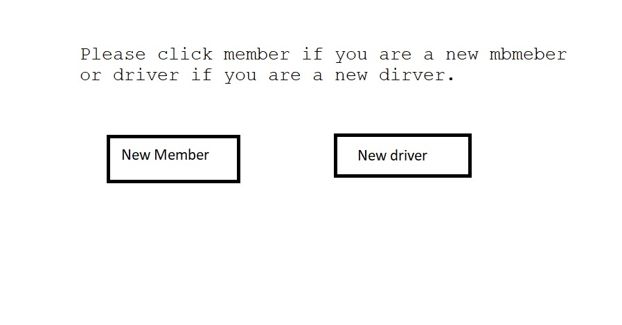
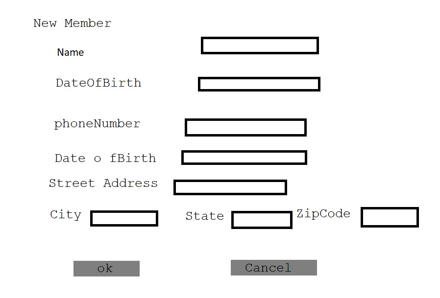
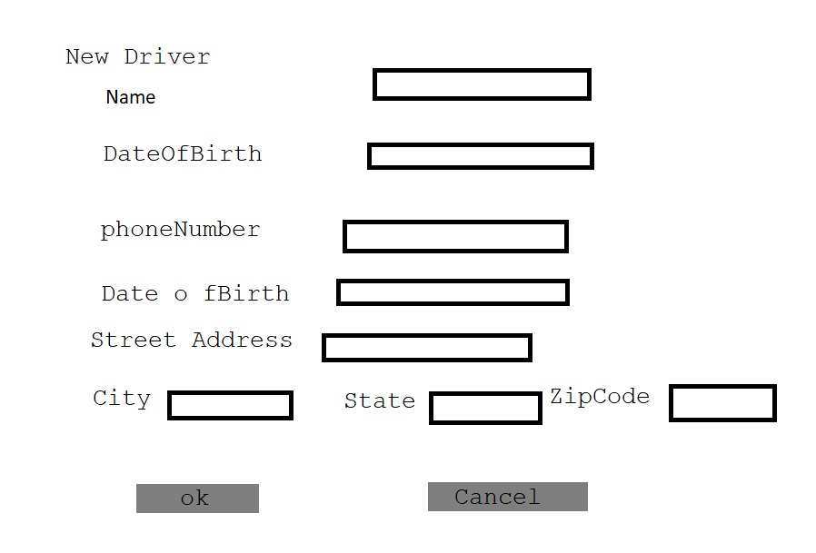
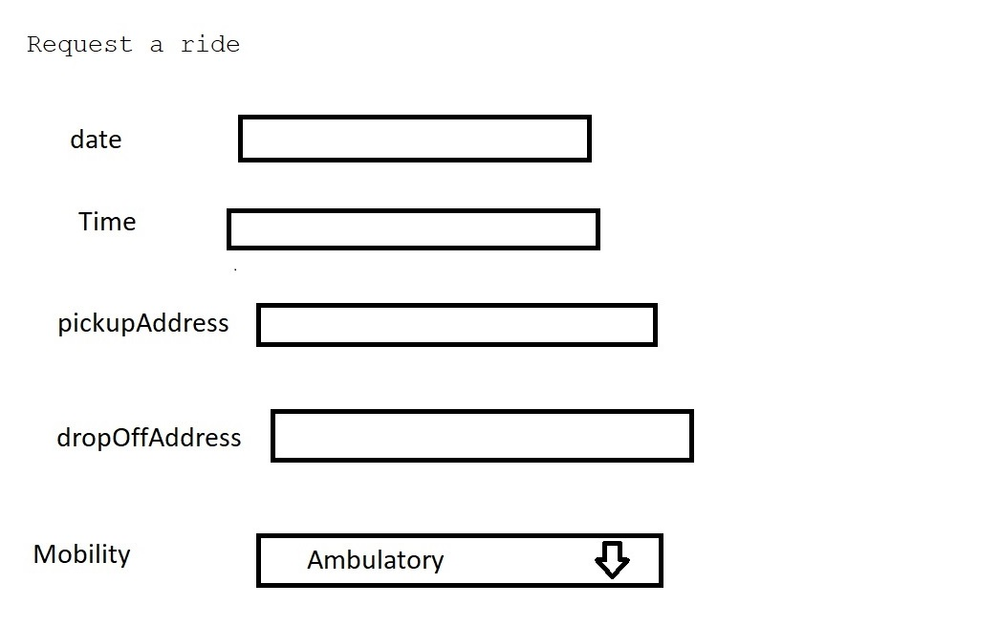
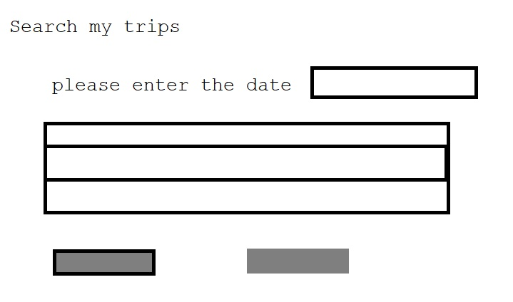

# Design Document

## None-Emergency medical transportation service

## 1. Problem Statement

   None-Emergency medical transportation needs efficient ways to help people request a ride to get to and from their doctor appointments and for the drivers to view and select the trips they will accommodate.
   None-Emergency medical transportation "Riders" service allows people to view, add, update, and remove trips,and the drivers to view and select the trips they will accommodate.

## 2. Top Questions to Resolve in Review
   - How will I uniquely identify the trips ? ( What will the key structure be for the table) - assign a unique ID to every trip [UUID] .

## 3. Use Cases

U1. As a [None-Emergency medical transportation service] member, I want to add a new trip (request a ride).

U2. As a [None-Emergency medical transportation service] member, remove my trip (cancel my ride).

U3. As a [None-Emergency medical transportation service] member, I change my trip time/date.

U4. As a [None-Emergency medical transportation service] member, I want to view the all trips I requested.

U5. As a [None-Emergency medical transportation service] driver, I want to view all trips.

U8. As a [None-Emergency medical transportation service] driver, I want to View a subset of all trips by filtering based on date, time, and zipcode.

U6. As a [None-Emergency medical transportation service] driver, I want to select the trip I will accommodate.

U9. As a [None-Emergency medical transportation service] driver, I want to unselect the trip I will not accommodate (vehicle broken).

U10. As a [None-Emergency medical transportation service] drive, I want to know how many miles the trip is.

U11. As a [None-Emergency medical transportation service] member, I want to request a convenient type of vehicle to pick me up (lower ride, van).

U12. As an [None-Emergency medical transportation service] owner,I want to manage the members.

U13. As an [None-Emergency medical transportation service] owner,I want to manage the drivers.

## 4. Project Scope

# 4.1. In Scope

   * The use cases U1-U9.

# 4.2. Out of Scope

   * The use cases U10-U13.

## 5. Proposed Architecture Overview

   A web interfaces for members to add,manage and view their trips, and for the drivers to view and select the trips they will accommodate.
   I will store the trips in a table of trips in DynamoDB. I will also store member in a table of members and drivers in a table of drivers.

## 6. API
   # 6.1. Public Models

```
 //trips (model)
   
String tripID; 
String memberID;
String pickupDateTime;
String pickupStreetAddress;
String pickupCity;
String pickupState;
String pickupZipCode;
String dropOffStreetAddress;
String dropOffCity;
String dropOffState;
String dropOffZipCode;
String mobility;
String driverId;
Boolean completed;
```

```
 // drivers (model)
String memberEmail; 
String name;
String DateOfBirth;
String phoneNumber;
String streetAddress;
String city;
String state;
String zipCode;
```

```
 //members (model)
String driverEmail; partition
String name;
String driverLicense
String phoneNumber;
String streetAddress;
String city;
String state;
String zipCode;
```

### 6.2. `view the all trips `

* Accepts `GET` requests to `/trips`

### 6.2.b `Viewtrip`

* Accepts `GET` requests to `/trips/:tripId`

### 6.3  `Addtrip`
* Accepts `POST` requests to `/trips`

### 6.4  `Updatetrip`
* Accepts `PUT` requests to `/trips/:tripId`.

### 6.5  `Deletetrip`
* Accepts `DELETE` requests to `/trips/tripId`.


## 7. Tables

### 7.1. `trips`

```
tripId // partition key, string
memberId // sort key string
pickupDateTime // string
pickupStreetAddress // string
pickupCity // string
pickupState // string
pickupZipCode // string
dropOffStreetAddress // string
dropOffCity // string
dropOffState // string
dropOffZipCode // string
mobility // string
driverId // string
completed // string

```

### 7.2. `drivers`

```

driverEmail // partition key, string
name // string
dateOfBirth // string
phoneNumber // string
streetAddress // string
city // string
state // string
zipCode // string

```
### 7.3. `members`

```

memberEmail // partition key, string
name // string
dateOfBirth // string
phoneNumber // string
streetAddress // string
city // string
state // string
zipCode // string
```

### 8. Pages

   
   
   
   
   